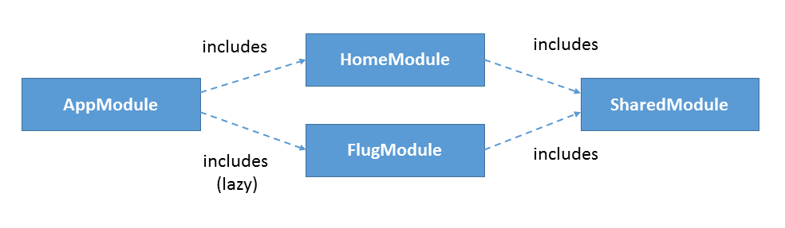

# Lazy Loading in Kombination mit Preloading in Angular 

## Überblick

## Benötigte Software

- NodeJS (nodejs.org)

## Installation und Ausführung

- Installation der Pakete: ``npm install``
- Start: ``npm start``

## Weitere Infos

- Blogeintrag zu [Preloading mit Angular 2](https://www.softwarearchitekt.at/post/2016/09/30/performanceoptimierung-mit-preloading-und-dem-neuen-angular-router.aspx)